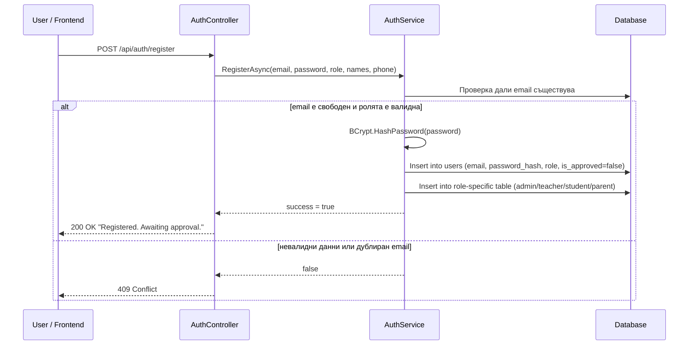
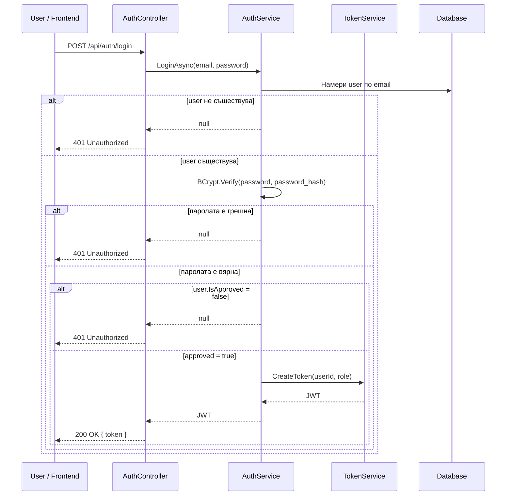
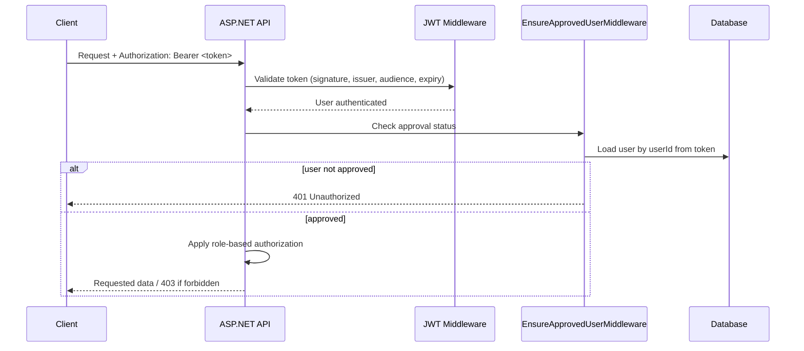
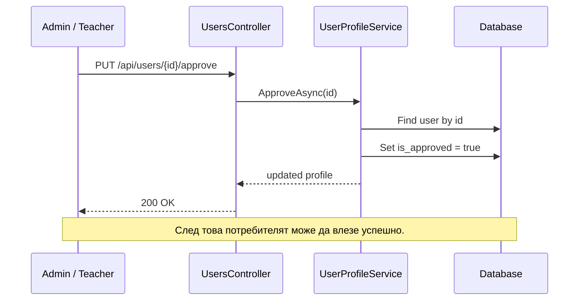
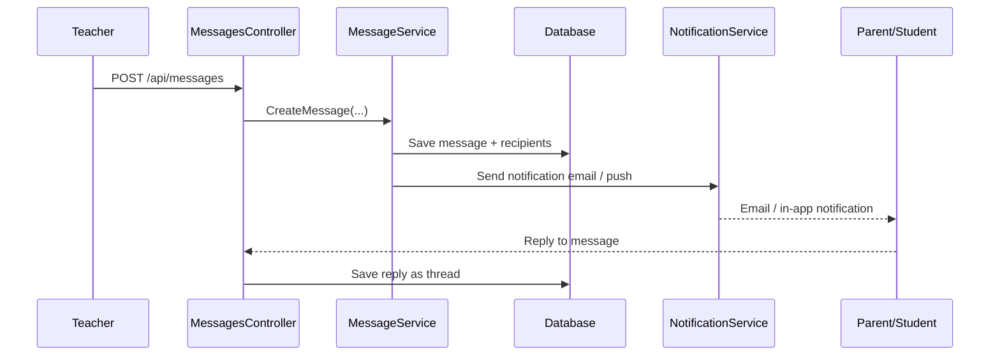
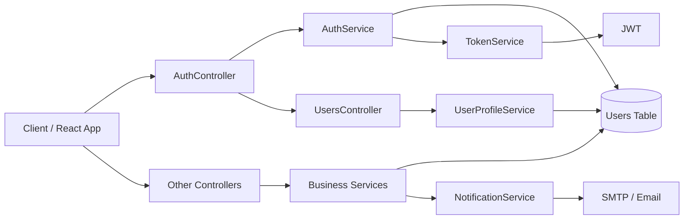

# Архитектура на auth, роли и flow за NemetschekDnevnik

Този документ описва целевия flow за регистрация, логин, JWT, одобрение от администратор/учител и основната защита на ендпойнтове според текущата реализация и задачите от Confluence.

## 2. Flow: Регистрация

### Какво се случва при регистрация

1. Потребителят изпраща email, password, роля и лични данни.
2. Сървърът проверява дали email не е вече регистриран.
3. Паролата се hash-ва с BCrypt.
4. В `users` се записва потребител с `is_approved = false`.
5. В зависимост от ролята се създава допълнителен запис в `admins`, `teachers`, `students` или `parents`.
6. Потребителят не може да влезе, докато не бъде одобрен.

## 3. Flow: Login

### Как работи login

1. Сървърът търси потребител по email.
2. Проверява дали въведената парола съвпада с `PasswordHash` чрез BCrypt.
3. Проверява `IsApproved`.
4. Ако всичко е наред, генерира JWT.
5. JWT се връща на клиента и се пази в localStorage/sessionStorage/в memory.

## 4. Flow: JWT и Authorization

### Как работи JWT

- JWT се генерира от `TokenService`.
- Вътре в токена се слагат claims:
  - `NameIdentifier` = `userId`
  - `Role` = `roleName`
- Токенът се подписва със HMAC-SHA256.
- Валидацията е зададена в `Program.cs` чрез `AddJwtBearer`.
- Срокът на валидност е 8 часа.

### Важни бележки

- В момента токенът не съдържа refresh token.
- В момента няма email verification.
- В момента няма login throttling / lockout / password reset flow.

## 5. Flow: Администраторско одобрение

### Какво прави администратора

- Вижда списък с чакащи регистрации.
- Одобрява или блокира потребител.
- Изтрива невалиден или нежелан профил.
- Има достъп до административни операции, които са защитени с `[Authorize(Roles = "Admin")]`.

## 6. Ролеви права и защита

Текущата логика трябва да се разшири в следните нива:

### Ниво 1: Auth
- `POST /api/auth/login`
- `POST /api/auth/register`

### Ниво 2: Authorization
- `Admin` -> пълен достъп до админ панел и управление на потребители
- `Teacher` -> достъп до дневник, оценки, отсъствия, съобщения
- `Student` -> достъп само до собствените оценки, домашни, отсъствия, профил
- `Parent` -> достъп само до данните на собствените деца

### Ниво 3: Data access rules
- Ученикът не трябва да вижда данните на други ученици.
- Родителят трябва да вижда само децата, които са свързани чрез `ParentStudentRelation`.
- Учителят трябва да вижда само класове/ученици, за които е отговорен.

## 7. Какво трябва да се разшири в Models и Server

### A. User & security

Да се добавят/разширят полета в `User`:

- `IsBlocked`
- `EmailConfirmed`
- `LastLoginAt`
- `FailedLoginAttempts`
- `RefreshToken`
- `RefreshTokenExpiry`
- `PasswordResetToken`
- `PasswordResetExpiry`

### B. Parent-Student relations

В момента има връзка `Student.ParentId`, но според Confluence е по-добре да се въведе отделна таблица:

- `ParentStudentRelation`
  - `ParentId`
  - `StudentId`
  - `RelationType`
  - `IsActive`
  - `CreatedAt`

Това е по-гъвкаво и отговаря на изискването за “Many-to-Many”.

### C. Messages & notifications

Нужно е да се добавят модели:

- `Message`
- `MessageRecipient`
- `Notification`
- `SupportTicket`

### D. Calendar & LMS

- `CalendarEvent`
- `Attachment`
- `LmsMaterial`
- `Feedback`

### E. Audit / operations

- `AuditLog`
- `LoginAttempt`
- `PasswordChangeHistory`

## 8. Flow: Съобщения и известия

### Логика

- Учителят изпраща съобщение до клас или конкретни родителите.
- Сървърът записва съобщението и получателите.
- Генерира се уведомление/имейл.
- Родителят може да отговори и съобщението се записва като thread.

## 9. Recommended target architecture

## 10. Практически препоръка за реализация

1. Запази текущия flow за регистрация и login.
2. Добави `RefreshToken` и `EmailConfirmed`.
3. Замени/разшири current middleware с политики:
   - `RequireApprovedUser`
   - `RequireRole_Admin`
   - `RequireRole_Teacher`
   - `RequireRole_Student`
   - `RequireRole_Parent`
4. Добави `ParentStudentRelation` вместо проста `Student.ParentId`.
5. Добави `Message`, `Notification`, `AuditLog`, `SupportTicket`.
6. За всички чувствителни операции логвай действията.

## 11. Кратко обобщение

Най-важното е да се следва този модел:

- Регистрация -> създаване на потребител с `IsApproved = false`
- Login -> проверка на парола + одобрение + създаване на JWT
- JWT -> защита на всички API ендпойнти
- Admin -> одобрение и управление
- RBAC + data ownership rules -> ограничаване на достъпа според роля и собственост
- Следващи фази -> съобщения, известия, LMS, календар и отчети
